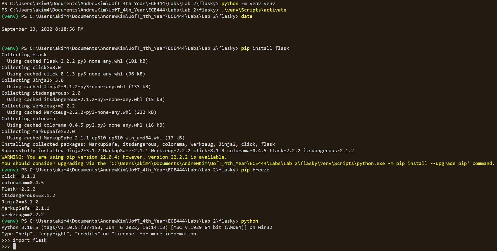
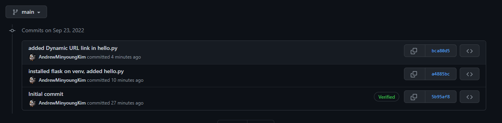
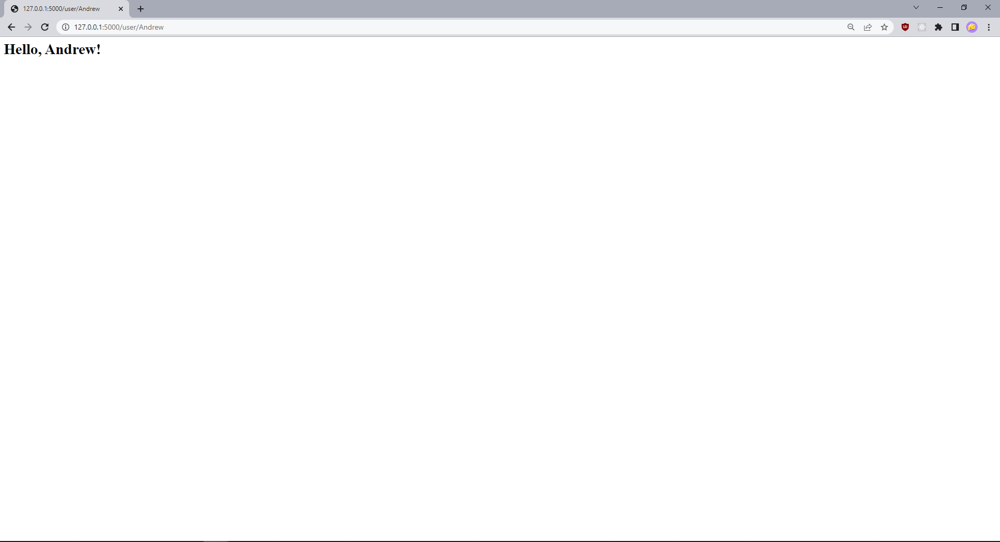
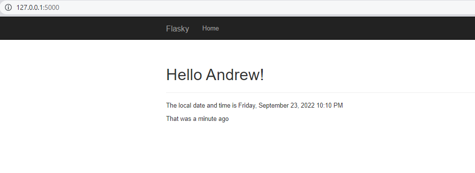

# Andrew Kim
------
This repo is a clone of https://github.com/miguelgrinberg/flasky

### Activity 1

### Activity 2
added hello.py is commit 1 where I added file and added bare Example 2-1 code. 
Second commit, Example 2-2, I added the Dynamic URL route

### Activity 3

### Activity 4

