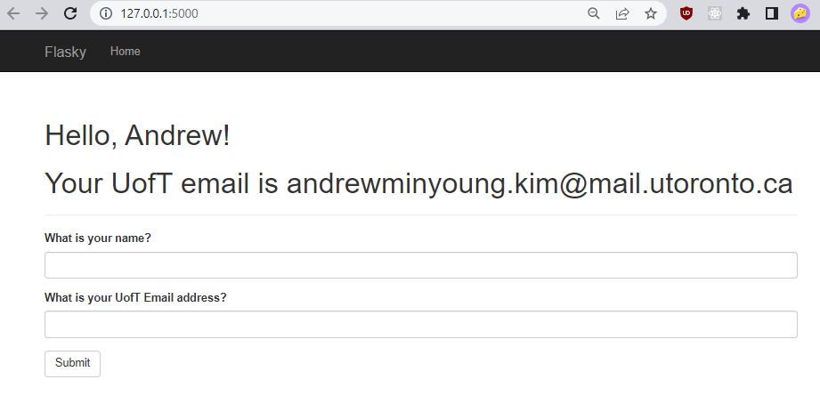

# Andrew Kim

---

This repo is a clone of https://github.com/miguelgrinberg/flasky

### Activity 1

Successfully finished the task with timestamp

### Activity 2

Added hello.py is commit 1 where I added file and added bare Example 2-1 code.
Second commit, Example 2-2, I added the Dynamic URL route

Output

### Activity 3
Commit message for completing activity 3

Output

### Activity 4

Both commit messages for finishing Step 1&2 and screenshots

